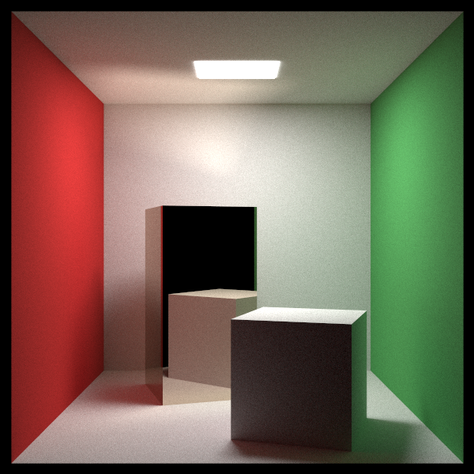
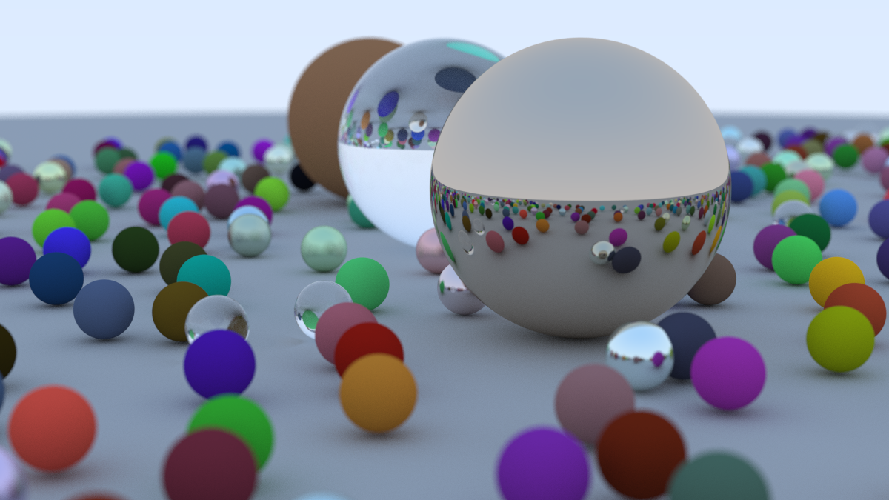

# raytracing

*a toy software path tracer.*

This started as a Rust implementation of the [_Ray Tracing in One Weekend_](https://raytracing.github.io/books/RayTracingInOneWeekend.html)
path tracer (h.t. [kipply](https://kipp.ly/) for [the book shoutout](https://kipp.ly/past-webdev/)).
I wouldn't describe the implementation as faithful though; I ultimately preferred some different patterns and felt
that the C++ structure didn't form idiomatic Rust (not particularly surprising).

Afterward, I continued iterating on code structure and added some features I was interested in.
The changes after [8b4bf4a](https://github.com/seridescent/raytracing/commit/8b4bf4a38568a4a79a3780355e9addcd6785afc7)
didn't follow any guided resources, but were of course influenced by a wide array of more general sources I found online.

I'm particularly happy with the [bounding volume hierarchy implementation](https://github.com/seridescent/raytracing/tree/main/src/bvh).
The construction routine partitions and builds the compact BVH structure in the same pass, which I thought was neat.
I also implemented a few different partitioning strategies to play around with, ending with one that uses
a surface area heuristic.

I intended to write a deeper retro on this, but I got a little too deep on an flawed explanation of path tracing and then burnt out.
I may spin up on that again and look more toward the software, in which case I'll link the retro here.
In the meantime, you might like some other stuff on my website, [seridescent.com](https://seridescent.com).

<figure>
  
  <figcaption>Polished tall box, diffuse short box. See <a href="./examples/cornell_box.rs">cornell_box.rs</a></figcaption>
</figure>

anecdotal run on my M1 pro mbp:
```shell
cargo run --profile release > cover_spheres.ppm && pnmtopng cover_spheres.ppm > cover_spheres.png
   Compiling raytracing v0.1.0 (/Users/seridescent/projects/raytracing)
    Finished `release` profile [optimized] target(s) in 1.10s
     Running `target/release/raytracing`

Done!
Total runtime: 70.69760925s
BVH construction: 1.411125ms
Rendering: 70.696197917s
```


## limitations

Since this is basically an academic endeavor, I limited myself by:

1. Not looking at or copying from existing codebases going through this book, for which there are many.
2. Not asking any LLMs for code generation or specific code guidance.
However, I did end up going back and forth with Claude on some path tracing concepts and some typing concepts.
