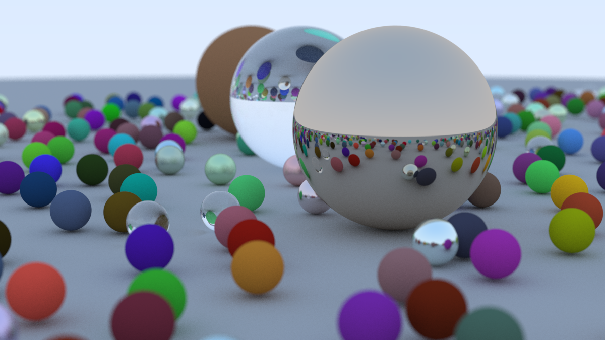

# raytracing
going through "Ray Tracing in One Weekend".

anecdotally:
```shell
cargo run --profile release > cover_spheres.ppm && pnmtopng cover_spheres.ppm > cover_spheres.png
   Compiling raytracing v0.1.0 (/Users/seridescent/projects/raytracing)
    Finished `release` profile [optimized] target(s) in 1.10s
     Running `target/release/raytracing`

Done!
Total runtime: 350.454651s
Rendering runtime: 350.454531083s
```


## intended limitations

Since this is basically an academic endeavor, I'm limiting myself by:

1. Not looking at or copying from existing codebases going through this book, for which there are many
2. Not asking any LLMs for code guidance
